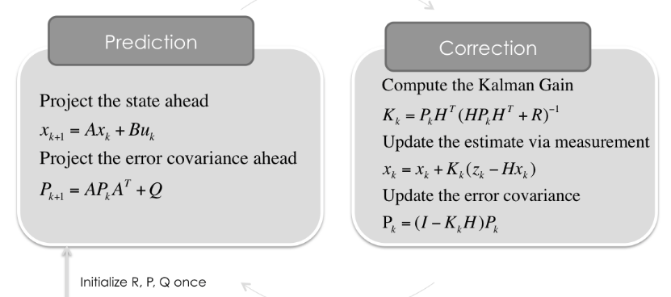
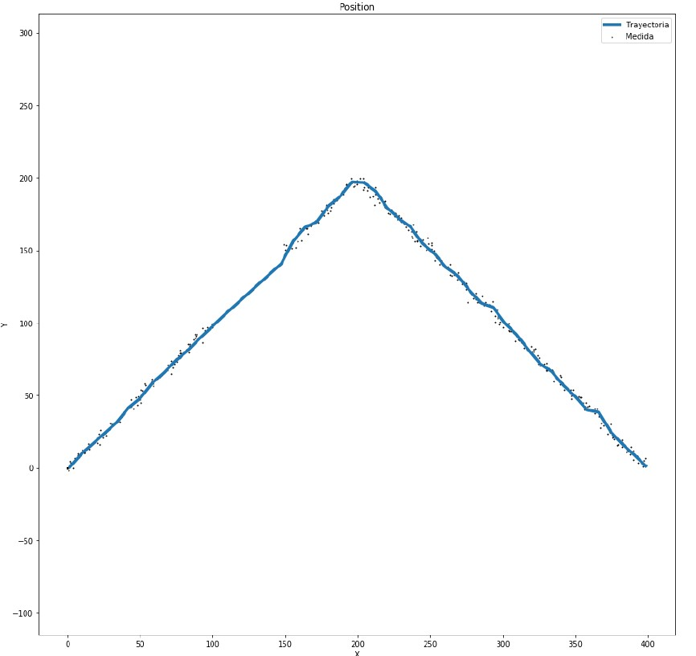

# Kalman-Filter-Based-GPS-Signal-Tracking
Kalman filter is an optimal estimator, i.e. infers parameters of interest from indirect, inaccurate and uncertain observations. The filter uses a Gaussian approximation and minimizes the mean square error of the estimated parameters and only propagates the mean and covariance of the predictive and posterior distributions. The underlying model is a Bayesian model similar to hidden Markov model. The Kalman filter algorithm is what used for the tracking purpose in this program instead of a traditional PLL carrier discriminator filter.

